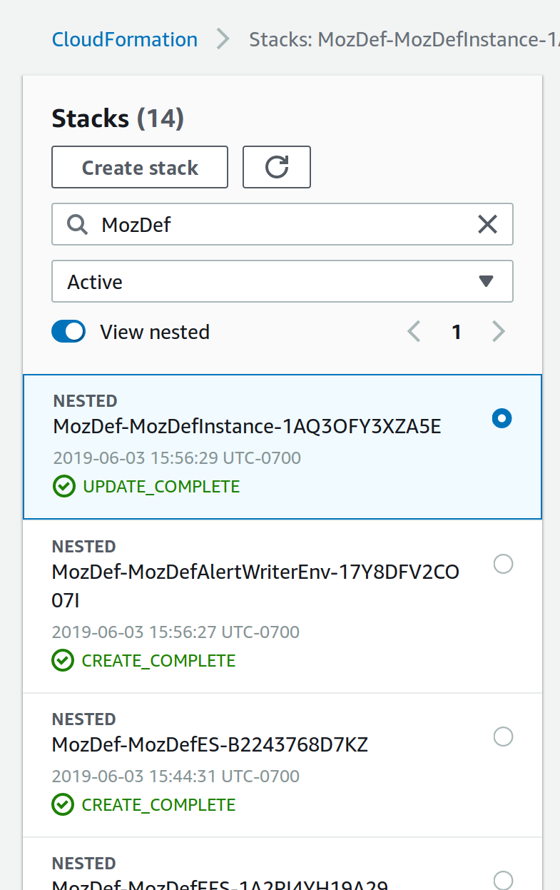
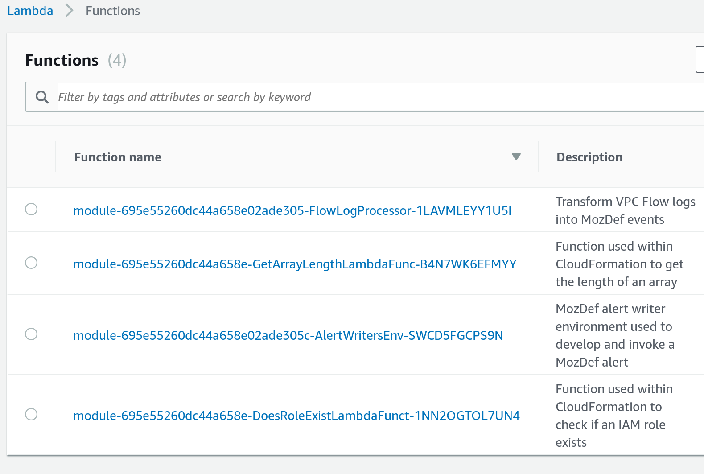
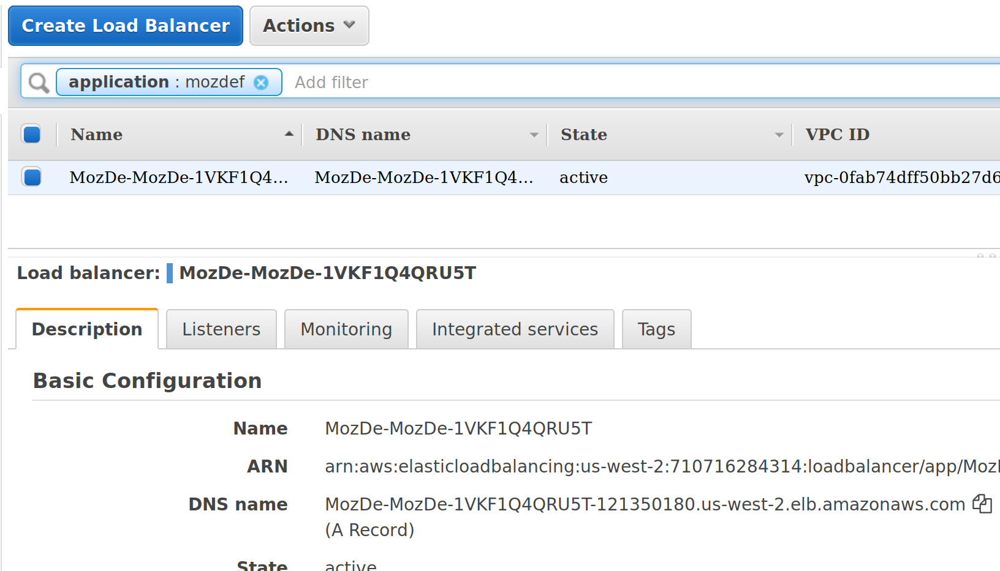
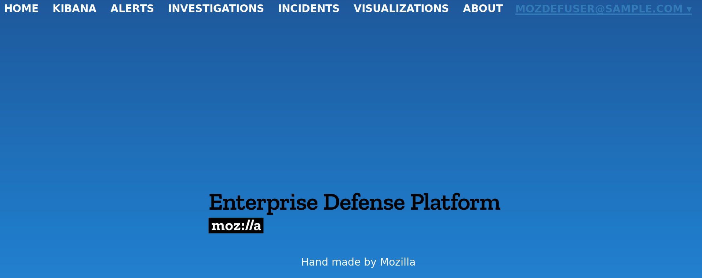
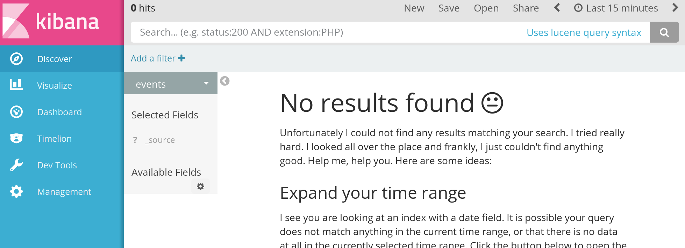

# Security Simulation Overview

In this section you will log into your AWS account, look around at what's in the
account and ensure that everything is setup correctly.

## Log in to your lab AWS account

* Go to the [Event Engine](https://dashboard.eventengine.run/login)
* Enter your hash (will be given to you) and click proceed

You will be able to set a team name and to access the AWS Web Console and CLI from this page. Just click the console link to go to the web console, or copy paste the CLI credentials if you prefer using AWS CLI.

## Explore the AWS account contents

Familiarize yourself with the contents of your account. You'll find MozDef is
deployed in your account using CloudFormation. 

* Browse to the [CloudFormation product in the AWS console](https://us-west-2.console.aws.amazon.com/cloudformation/home).
* Limit the CloudFormation stacks shown in the console by typing `mozdef` in the
  stack search bar and hitting <kbd>Enter</kbd>
  
  * You'll see both the root CloudFormation stack called `MozDef` as well as
    the various nested stacks. All the AWS resources that makeup MozDef can be
    found in these stacks.
* Browse to the [Lambda product in the AWS console](https://us-west-2.console.aws.amazon.com/lambda/home).
  * Click the `module-[...]-AlertWritersEnv-[...]` Lambda function to see an example
    MozDef alert and author your own
    
* Browse to the [EC2 product in the AWS console](https://us-west-2.console.aws.amazon.com/ec2/v2/home).
* View [Load Balancers](https://us-west-2.console.aws.amazon.com/ec2/v2/home?region=us-west-2#LoadBalancers:)
  to find the AWS Application Load Balancer (ALB) you'll use to access the MozDef
  web UI.
  * You can find the MozDef ALB by searching for `tag:application : mozdef`
    
  * In the description field of the load balancer you'll see the DNS name of the
    load balancer. Click the copy  icon to
    copy the URL to your clipboard.
* Paste the URL into another tab to browse to the MozDef web UI
  * The HTTP basic auth username is `mozdef` and the default password is `password`
    
  * Once you log in you'll see the MozDef web UI
    
* Visit the Kibana data visualizer by clicking the `KIBANA` menu item. This will
  prompt for the same HTTP basic auth username and password, `mozdef` and `password`
  

## Verify environment is complete

Ensure that you are able to get to the MozDef web UI and Kibana data visualizer
UI.
