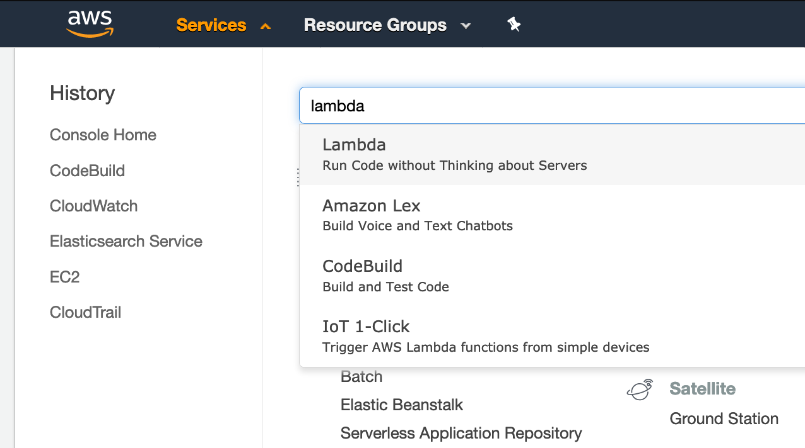
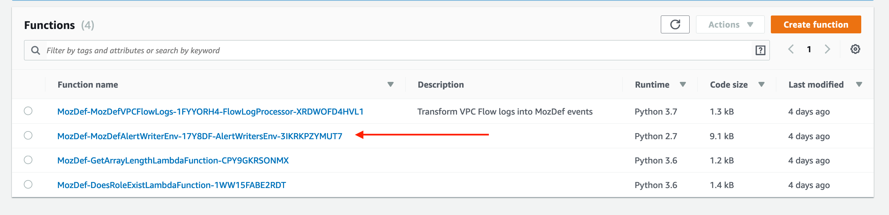
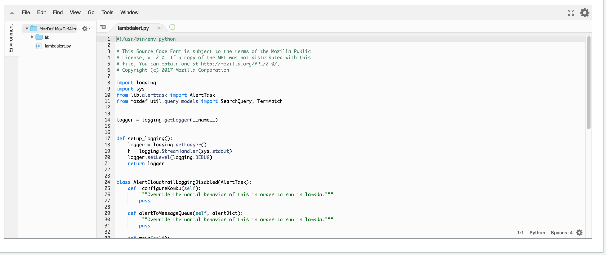

# Exploration and Alert Authoring

By now you have explored the MozDef web interface, understood how data is ingested, examined the data sources, and heard about the attack simulation taking place in your account.
It's time to take that understand and use *AWS Lambda* along with the MozDef alert framework to craft some automated detection.  
In order to write an alert we must understand how the alert system reasons about data.

In a normal MozDef alert flow the system ingests messages from SQS or other style message queue.  The message is required to be 
normalized in the MozDef [event format](https://github.com/mozilla/MozDef/blob/master/docs/source/usage.rst).

### Alerts can be triggered one of two ways:

* __On Event__ - an alert reasons about a single message.
* __On aggregation__ - alert runs periodically to reason about many messages inside of a progressively sliding time window. 

### Lambda alert writers environment:

In order to familiarize you with the MozDef alert framework and doing some coding in python we have provided you with a single lambda function running inside of the same VPC that the instance of ElasticSearch is running in.  This means that you can hack on a bit of code to detect some of the IOCs that were presented in the security simulation briefing.

Go ahead and navigate to the lambda environment in your console.



> Note: these have only been deployed in the us-west-2 region.



You should see a lambda function similarly name to the one above.  Click on it to see the Cloud9 IDE.



Scroll down past the boiler plate code to turn on the python logger to find an object in python called: `AlertCloudTrailLoggingDisabled`.

Pay careful attention to the methods within the object called: `onEvent` and `main`

`main` is designed to take a single event and then perform a search in elastic whereas `onEvent` will execute if the search terms are matched in elastic.  **Uncomment lines _38 - 41_** and customize the search terms in order to modify the alert to match on `StopLogging` instead of `DescribeTable`.

AWS Lambda will retry if the function doesn't return `200`.  Change the last three lines of the function to instead be:

```python
    logger.debug('Function initialized.')
    a = AlertCloudtrailLoggingDisabled()
    print(a.main())
    return 200
```
This should result in the function executing, printing a status you can see, and exiting appropriately when you push the test button.

> **Note**: you may also elect to customize the messaging in the `main` object.  Ultimately this is what will surface on the alerts page in the MozDef UI.  

When ready to test your code, first save the code by pressing the "Save" button, then push the "Test" button in lambda.  If no test event structure is configured feel free to create one.  Since we'll be running this manually or as a CloudWatch Event cron the `event` payload passed in from AWS Lambda will be ignored. 

**Congratulations** you have just written your first alert in MozDef.  Feel free to play with the alert terms a bit to understand just how much flexibility there is in the "simple" onEvent style alert.  

You may also run multiple alerts inside the same lambda function by copying and pasting the code block called `AlertCloudTrailLoggingDisabled` and adding them to the main lambda event handler. 

_Note:_ that these classes must have unique names inside of the same lambda function.  The names should be descriptive of what you are attempting to alert on.  

For example if you wanted to generate an alert every time there was an ssh console login (_not aws console_) you might write a class that looks like:

```python
class AlertMyFirstAlert(AlertTask):
    def _configureKombu(self):
        """Override the normal behavior of this in order to run in lambda."""
        pass

    def alertToMessageQueue(self, alertDict):
        """Override the normal behavior of this in order to run in lambda."""
        pass

    def main(self):
        # How many minutes back in time would you like to search?
        search_query = SearchQuery(minutes=15)

        # What would you like to search for?
        search_query.add_must([
            TermMatch('source', 'vpc_flow'), # The source is vpc_flow logs
            TermMatch('details.destinationport', 22)
        ])

        self.filtersManual(search_query)
        self.searchEventsSimple()
        self.walkEvents()

    def onEvent(self, event):
        category = 'vpc_flow'

        # Useful tag and severity rankings for your alert.
        tags = ['aws', 'vpc_flow']
        severity = 'WARNING'

        # What message should surface in the user interface when this fires?
        summary = 'A user attempted an ssh session to port 22.'

        # This could also include correlating the number of bytes exchanged # to understand if this was a successful SSH session vs a tcp RESET

        return self.createAlertDict(summary, category, tags, [event], severity)

        # Learn more about MozDef alerts by exploring the "Alert class!"

```

Then we simply add our new class to the main method in order to get the alert to run.

```python
    logger.debug('Function initialized.')
    a = AlertCloudtrailLoggingDisabled()
    b = AlertMyFirstAlert()
    print(a.main())
    print(b.main())
    return 200
```

> Now both alerts run as part of a single lambda execution.  If the alerts match on terms you will see these surface in the MozDef UI.

### Aggregation alerts

In the prior exercise you explored the MozDef simple alert pattern.  Now let's explore the alert aggregation pattern.  The alert aggregation is useful for correlation of multiple points of data across a time series.

Below is an example of a simple aggregation that is running on another system _not AWS Lambda_ in your environment.

```python
#!/usr/bin/env python

# This Source Code Form is subject to the terms of the Mozilla Public
# License, v. 2.0. If a copy of the MPL was not distributed with this
# file, You can obtain one at http://mozilla.org/MPL/2.0/.
# Copyright (c) 2014 Mozilla Corporation


from lib.alerttask import AlertTask
from mozdef_util.query_models import SearchQuery, TermMatch, ExistsMatch


class AlertCloudtrailExcessiveDescribe(AlertTask):
    def main(self):
        # Create a query to look back the last 20 minutes
        search_query = SearchQuery(minutes=20)

        # Add search terms to our query
        search_query.add_must([
            TermMatch('source', 'cloudtrail'),
            TermMatch('details.eventverb', 'Describe'),
            ExistsMatch('details.source')
        ])

        self.filtersManual(search_query)
        # We aggregate on details.hostname which is the AWS service name
        self.searchEventsAggregated('details.source', samplesLimit=2)
        self.walkAggregations(threshold=50)

    def onAggregation(self, aggreg):
        category = 'access'
        tags = ['cloudtrail']
        severity = 'WARNING'
        summary = "Excessive Describe calls on {0} ({1})".format(aggreg['value'], aggreg['count'])

        # Create the alert object based on these properties
        return self.createAlertDict(summary, category, tags, aggreg['events'], severity)
```

> Note: That in the above example instead of using `onEvent` we instead use onAggregation.  

The alert logic flows over a sliding window which in this case pulls back 20 minutes of cloudtrail data at a time.  

#### Code Highlights from aggregation

```python
        # We aggregate on details.hostname which is the AWS service name
        self.searchEventsAggregated('details.source', samplesLimit=2)
        self.walkAggregations(threshold=50)
```

In the above codeblock there are two key terms `sampleLimit` and `threshold`.

* `samplelimit`: is how many times the alert will sample elasticsearch using the search terms.
* `threshold`: in the totality of the two samples for the given time window.  The terms must match this number of times.

**This means that for the above alert to fire.  In 20 minutes inside of 2 samples there MUST be 50 events that are eventVerb type Describe in order to trigger the "excessive describe calls" alert.**

### Lab Exercise

For your lab exercise in this section choose the appropriate alert to do the following:

1. Detect the creation of new tags on instances,  using simple alerts.  The API call should be `ec2:CreateTags`.  You can test this by adding a tag to a system in your account.
**Solution:** A solution has been provided [here](../solutions/02-alert-writing.md)

> Note: In an upcoming lab you will be able to use an aggregation as part of an investigation. Also, it can take a few **minutes** for the event to propagate and be available in Kibana once you create the tag. 
