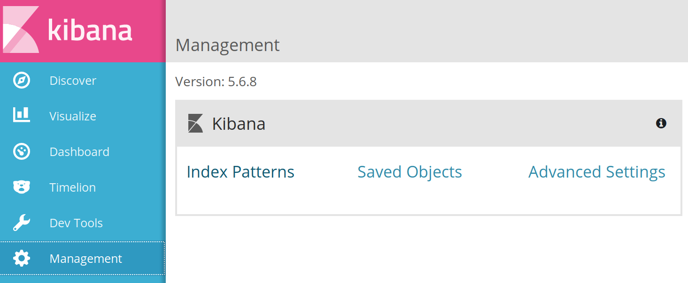
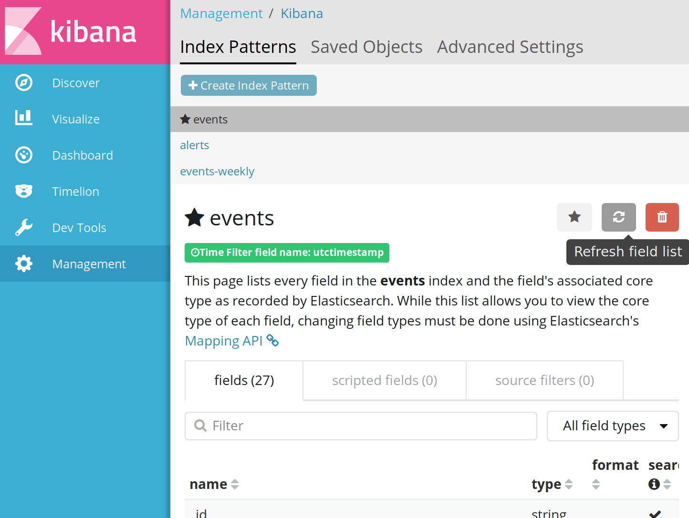

# Investigating

You've seen an alert or are exploring an issue (*you're threat hunting*). You now need to be able to dive into the
event data and figure out what happened, to what extent, which systems are involved and so on.

## Setup

Now that you have a working MozDef with real data in it, you will want to have
Kibana refresh the field list based on the real data now present. This will
enable you to search and filter on these fields.

* Browse to MozDef using the load balancer DNS name. Then click `KIBANA` in the
  menu bar.
* In Kibana click the `Management` tab on the left
* On the Management page click `Index Patterns`
  
* On the Index Patterns page, in the `events` index area, click the refresh icon
  on the right (between the star and the trash can icons) to refresh the field
  list.
  
* Return to the `Discover` tab and you'll find that you can now search or filter
  on any field.

## SSH Traffic from the Outside

### Scenario

As a security engineer, you imagine that at some point, there will be unwanted SSH connections going to systems that no
one normally connects to. You're tasked with making sure that when it happens you'll be able to find out.
In our workshop sandbox, we've simulated that event for you.

Would you be able to find the connections attempts? Can you tell which one were successful (i.e. attacker got a shell)?
Using the learnings from the previous lab, can you draft how an alert for this event would look like?

> **Tip**: Successful SSH connections result in more data being sent over the wire than unsuccessful ones. Look for vpc
> flow data!

### Breadcrumbs

- Find connections to the conventional SSH port: 22 (TCP)
- Figure out the event format
- Find a way to understand if the connection was successful (attacker got a shell) or not

> **Note**: In a real environment, SSH may be running on different ports, so you might need some protocol analysis as
> well. Additionally, in some cases you might want to use different log sources, such as SSH logs themselves, if
> available - or use them in combination with other types of logs. The amount of data that is found in the flow logs can
> be very close between a successful and an unsuccessful connection, so it's not always reliable - but we also don't
> have perfect logging, and it's often sufficient. Remember to think out of the box!

## Alert : Attacker is surveilling an account 

### Scenario

An attacker, when first gaining access to an account, may begin by performing
reconnaissance on the account to understand both what's present in the account
as well as what AWS products they have access to with the credentials they're 
using. This process could be detected using MozDef based on the fact that the
reconnaissance necessarily results in an excessive number of `Describe` calls
to the AWS API which result in CloudTrail records.

Try to determine if an actor is performing a large number of `Describe` calls
in your AWS account and if so, find out who's making the calls.

### What to do

* Look for unusual patterns of AWS API calls visually
  * In Kibana, restrict the records you're looking at to only CloudTrail logs which
    have a `category` value of `AwsApiCall` as well as a `source` of `cloudtrail`
  * Further limit the records you see in Kiabana using the `details.eventverb`
    field to view only describe calls.
  * Set the window of time that you're looking at to start 6 hours before the
    class began.
  * Look in the graph of events for unusually large amounts of describe API
    calls
  * Zoom into the time window around the spike in API calls
* Once you've identified the filters and time window that your interested in in
  the discover tab, you can visualize the data to understand what IAM users or 
  roles are making the calls. First save your query by clicking `Save` so you 
  can load it later in the `Visualize` section
* Next you'll want to determine what field you want to visualize
  * In this exercise you'll see that all the describe calls come from IAM users.
    You can tell this because the `details.useridentity.type` fields in the
    records have a value of `IAMUser`. For further reading, at the end of this
    page you can see what you would do if the actor was not an IAM user, but
    it's not required for this exercise.
  * As a result the field that you'll want to visualize is the `details.useridentity.username`
    which is the field in CloudTrail records created by IAM users that contains
    the IAM user's username
  * Copy `details.useridentity.username` into your clipboard to use in a moment
  * Click the `Visualize` tab
  * Click the plus sign  to add
    a new visualization
  * Click `Pie` to create a pie chart
  * Click the saved search you just saved to load your search in
  * Click `Split Slices`
  * In `Aggregation` choose `Terms`
  * In `Field` paste the term name, `details.useridentity.username` from your
    clipboard that you want to visualize
  * Click the play icon 
    to apply changes and run the visualization
  * The resulting pie chart will show what IAM user or role is making the calls
  
### Further Reading

#### Different ways identity information is stored in CloudTrail records

* Explore the events to see the different ways that an IAM identity shows up
  in a CloudTrail record  
  * IAM Users
    * Search for `details.useridentity.type:IAMUser`
    * Find the IAM User name at `details.useridentity.username`
  * IAM Role
    * Search for `details.useridentity.type:AssumedRole`
    * IAM Role name at `details.useridentity.sessioncontext.sessionissuer.username`
    * IAM User that assumed the role
      * If the IAM user that assumed the IAM role is in the same account as the 
        role you can determine the user from the role. Note : If the IAM user
        is not in the same AWS account, for example because of cross account
        role assumption, you won't be able to determine what IAM user in a
        foreign account assumed the IAM role
      * Determine the ephemeral access key ID produced from the role assumption
        by copying the `details.useridentity.accessKeyId` value into your
        clipboard
      * Search for calls to the AWS STS service that produced that access key
        ID. For example, if the value in the `details.useridentity.accessKeyId`
        field was `AROAICKBBQTXWLEXAMPLE`, then you would search for STS calls
        the returned that value in the `details.responseelements.credentials.accessKeyId`
        field. The search would look like
        `source:cloudtrail AND hostname:sts.amazonaws.com AND details.responseelements.credentials.accessKeyId:AROAICKBBQTXWLEXAMPLE`
      * Find the IAM user name in `details.useridentity.username`
  * There are other types of IAM entities like `AWSService` and `AWSAccount`
    which we'll ignore for now
