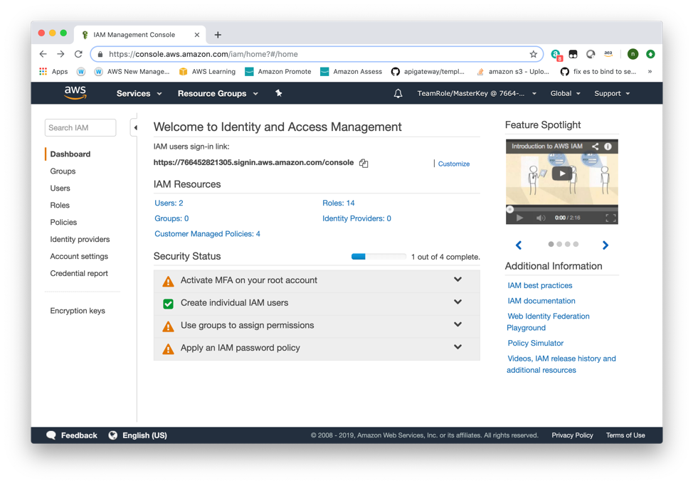
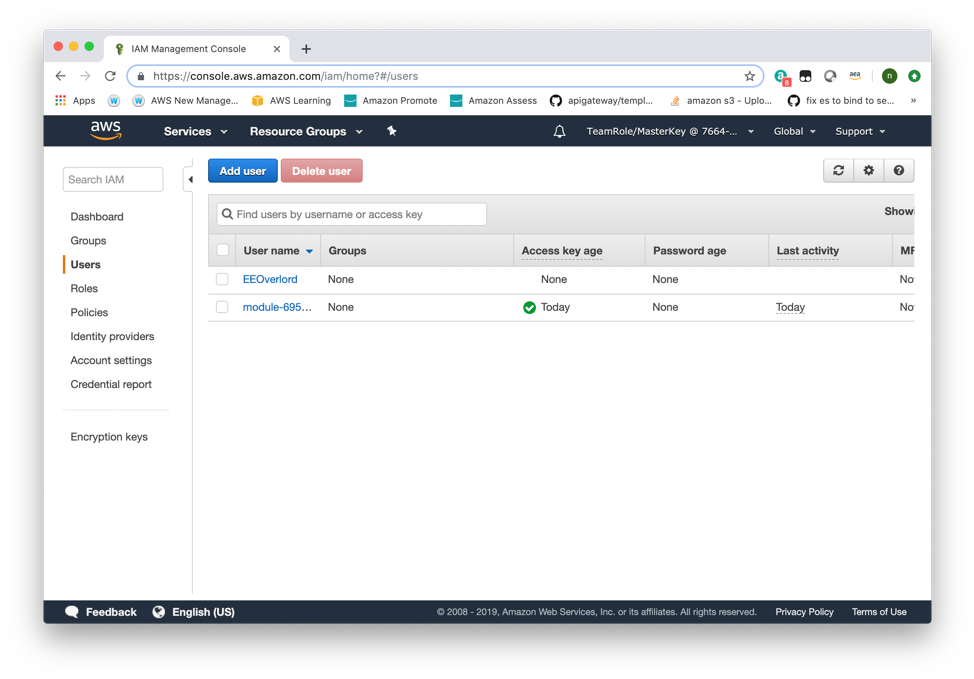
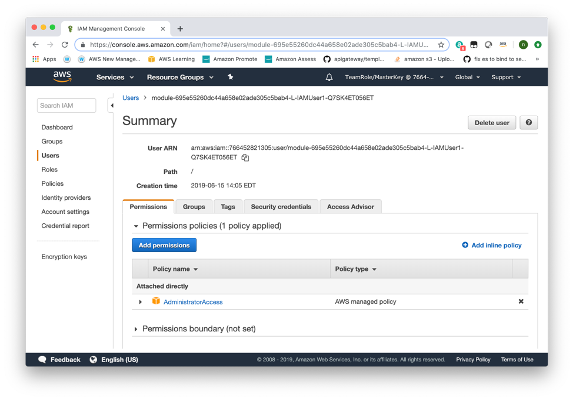
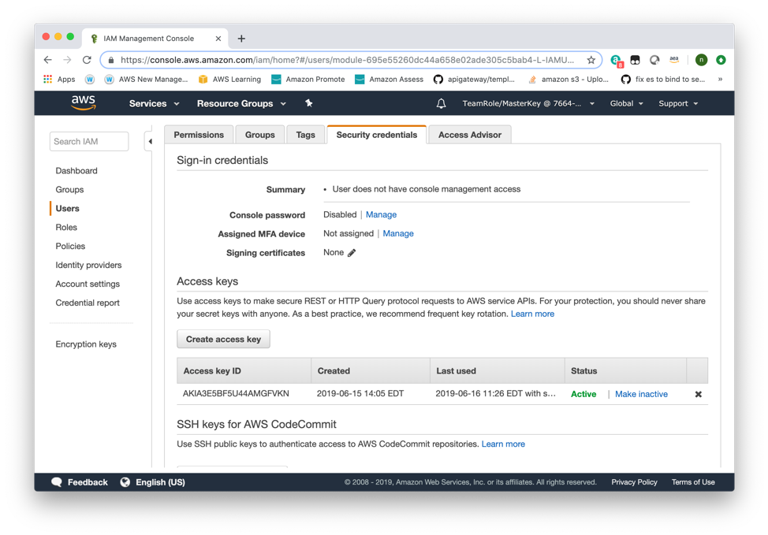
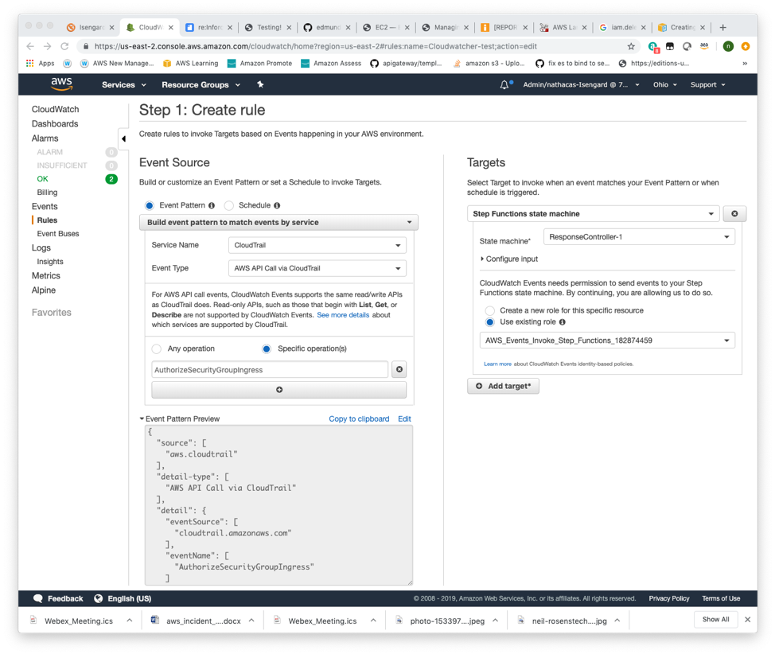

#
# Incident Response

So, we know there is an issue and we need to respond. We have to make some assumptions here, as we don't have a legal department or other parts of the equation that an enterprise would. The first assumption is that we are only moderately concerned about attribution, which may seem like an odd statement, but most companies aren't interested in attribution, as it is hard to do and offers little in the way of return on investment. Secondly, we are assuming that our make-believe enterprise doesn't have to worry about moving data across national borders or other HR issues that would be specific to different regions of the world.
Read Further:
[IR Whitepaper](https://d1.awsstatic.com/whitepapers/aws_security_incident_response.pdf)

## **Setup**

So, we know we have an issue, the first thing we need to do is decide how we want to deal with it. In this case we are going to assume that the enterprise is not interested in collecting data about bad actors. The two options are 1. Stop the bad actor, or 2. Observe the bad actor, and learn about them. As stated, we are going to follow option 1 and simply stop the attacker. In this case we have a compromised account and external SSH access.

We need to decide what to do first. If we decide we want to stop the bad actor, we need to look at the different avenues of access. In this case the actor has access to your account and one of your instances. In this case, we should turn off account access first in an effort to stop the bad actor from building new instances.

Step 1 – Removal of Control

Browse to the AWS Console and go to the IAM service

-  Once there click the Users link on the left. This will bring you to the Users Screen.

-   You will note that the access Key age is today, not a good sign, as it means that someone has just created access. Click on the user that starts with the word "Module-"

-  Here we can see that this user has Admin access. If we need to maintain this user for investigative purposes, we can simply remove the access that it has by remove the Policies that it has associated with it and changing the credentials. If a User that is associated with an application is compromised, we may only want to change the access keys and password. We do this by clicking on the Security Credentials tab.

- Here we can see that the user credentials have been used recently. We also have the option to remove the access the they may have, by clicking the "X" near make inactive. In a real world scenario it may be a very good choice to click the "Make Inactive" button, if the compromised user has existed for a long period of time and developers may have used these credentials. You will also note that this user is only able to use the API and not log into the console, as the console password says that this is disabled. Also please review if the user has an SSH key. If they do this would mean that the bad actor could infect any products that this user has the ability to touch.

## **SSH Traffic from the Outside**

Second, we need to address the issue of SSH traffic to a server that is on the open network. We have a multitude of choices to do this. The easiest two are:

1. Changing the subnet associated with the SSH line in the security group to remove the ability of the general internet to connect to this port.

2. Remove the SSH line altogether and use SSM to manage the system going forward, or build a bastion host.

**Tip** : Remember, if there is already an active SSH connection to a server, you will also have to set a NACL to break the session.

### **Breadcrumbs**

- Find the Security group/s that allow conventional SSH port: 22 (TCP)
- Figure out the event format

**Note** : In a real environment, SSH may be running on different ports, so you might need some protocol analysis as well. Additionally, in some cases you might want to use different log sources, such as SSH logs themselves, if available - or use them in combination with other types of logs. The data that is found in the flow logs can be very similar between a successful and an unsuccessful connection, so we can't always make a reliable judgement - but we also don't have perfect logging, and it's often sufficient. Remember to think out of the box!

## **Ok, you know how to do it by hand…**

### **Scenario (This is the hard part)**

In the real world you will need to do all of the above, over the course of half a second. You need to be able to automate all of it and do it quickly. In the real world, many of the actions that you would expect to do are pre written for you in tools like CloudCustodian or Warden. Warden is described in another session here at blackhat.

### **What to do**

### In this exercise you will build two simple lambda functions to correct the above issues and a step function to control them. The goal of this exercise is not to make a full application that you can deploy to a production environment but rather to show how to build a system which can help you as the student, understand the possibilities both good and bad.

### Step one:

Build out your work flow. The below is a step function that I used for a webinar, earlier this year. If you take a look at the parts, you can see that it is broken up into steps, each of these steps calls another step. Notice in the below step function that the "Resource" in each section is pointing to the ARN of a lambda function. There is also a "Next" item and it points to another step in the function.
There is also a try/catch portion of each step, that reviews the output of the step function and pushes the function to solve the issue it encountered. There is also a section called "IngestionType", which looks at the "ResultsPath" and evaluates the answers to switch over to a new steps. Also be aware that there is no order in the statement, it starts with the "StartAt" statement says it should, and ends at the "EndState" step.

### An example Step function:

  {

  "Comment": "Remediation\_Machine",

  "States": {

      "Failed": {

          "Type": "Pass",

          "Next": "EndState"

      },

      "IngestionAction": {

          "Resource": "arn:aws:lambda:us-east-2:99999999999:function:CloudWatcherCore",

          "ResultPath": "$.CloudWatcherCore",

          "InputPath": "$",

          "TimeoutSeconds": 86400,

          "HeartbeatSeconds": 60,

          "Next": "IngestionType",

          "Type": "Task",

          "Retry": [

              {

                  "ErrorEquals": ["States.ALL"],

                  "IntervalSeconds": 10,

                  "MaxAttempts": 5,

                  "BackoffRate": 2

              }

          ],

          "Catch": [ {

              "ErrorEquals": ["States.ALL"],

              "Next": "Failed",

              "ResultPath": "$.CreateSnapshot.error"

          } ]

      },

      "IngestionType": {

        "Type": "Choice",

        "Choices": [

          {

            "Variable": "$.CloudWatcherCore",

            "StringEquals": "EmergencyActionIfrastructure",

            "Next": "EmergencyActionIfrastructure"

          },

          {

            "Variable": "$.CloudWatcherCore",

            "StringEquals": "EmergencyActionAccount",

            "Next": "EmergencyActionAccount"

          },

          {

            "Variable": "$.CloudWatcherCore",

            "StringEquals": "EmergencyActionApplication",

            "Next": "EmergencyActionApplication"

          }

        ],

        "Default": "EndState"

      },

      "EndState": {

          "End": true,

          "Type": "Pass"

      }

  },

  "StartAt": "IngestionAction"

}

Step 1:

###         In the above Step function, decide what you want to do first.

### **Breadcrumbs**

As stated above, maybe we should take care of the account breach first. There is a way to do that automatically.

Review:

[https://boto3.amazonaws.com/v1/documentation/api/latest/reference/services/iam.html](https://boto3.amazonaws.com/v1/documentation/api/latest/reference/services/iam.html#IAM.Client.delete_user)

Example Lambda Script:

import boto3

def lambda\_handler(event, context):

    iam = client('iam')

    ec2 = client('ec2')

        iam.delete\_access\_key(

        AccessKeyId=event["ACCESS\_KEY\_ID"],

        UserName=event["IAM\_USER\_NAME"]

    )

Step 2.

 Work through the rquired SSH networking change. In a datacenter this could take a significant amount of time. This will be much quicker. How do we correct the Security Group? We use a similar Lambda function to that.

### **Breadcrumbs**

Review:

[https://boto3.amazonaws.com/v1/documentation/api/latest/reference/services/iam.html](https://boto3.amazonaws.com/v1/documentation/api/latest/reference/services/iam.html#IAM.Client.delete_user)

Example Lambda Script:

from \_\_future\_\_ import print\_function

import json, urllib2, boto3

def lambda\_handler(event, context):

    response = urllib2.urlopen('https://ip-ranges.amazonaws.com/ip-ranges.json')

    json\_data = json.loads(response.read())

    new\_ip\_ranges = [x['ip\_prefix'] for x in json\_data['prefixes'] if x['service'] == 'CLOUDFRONT' ]

    #print(new\_ip\_ranges)

    ec2 = boto3.resource('ec2')

    security\_group = ec2.SecurityGroup('sg-6rrrrr10')

    current\_ips = security\_group.ip\_permissions

    if len(current\_ips) == 0:

        current\_ip\_ranges = []

    else:

        current\_ip\_ranges = [x['cidrip'] for x in current\_ips[0]['ipranges'] ]

    print(current\_ip\_ranges)

    params\_dict = {

        u'PrefixListIds': [],

        u'FromPort': 80,

        u'IpRanges': [],

        u'ToPort': 443,

        u'IpProtocol': 'tcp',

        u'UserIdGroupPairs': []

    }

    authorize\_dict = params\_dict.copy()

    for ip in new\_ip\_ranges:

        if ip not in current\_ip\_ranges:

            authorize\_dict['IpRanges'].append({u'CidrIp': ip})

    revoke\_dict = params\_dict.copy()

    for ip in current\_ip\_ranges:

        if ip not in new\_ip\_ranges:

            revoke\_dict['IpRanges'].append({u'CidrIp': ip})

    print("the following new ip addresses will be added:")

    print(authorize\_dict['IpRanges'])

    print("the following new ip addresses will be removed:")

    print(revoke\_dict['IpRanges'])

    security\_group.revoke\_ingress(IpPermissions=[revoke\_dict])

    security\_group.authorize\_ingress(IpPermissions=[authorize\_dict])

    return {'authorized': authorize\_dict, 'revoked': revoke\_dict}

Step 3.

Once those functions are built and tested, you will need to incorporate them into the above Step Function in your lab. This part should be straight forward.

Step 4.

To test this step function, you need to trigger it in some way. The best way to test this is add a cloud watch event.

This example show the connection for the Step function from above and the needed events in CloudTrail. We can expand this pattern to include many items that are concerning. If we choose

to we can build StepFunctions to deal with other Cloud trail events that we deem to be untoward.

Once we have completed this step, this lab is complete, and you should have the basic skills that will allow you build a system, to respond to a threat in your application.
