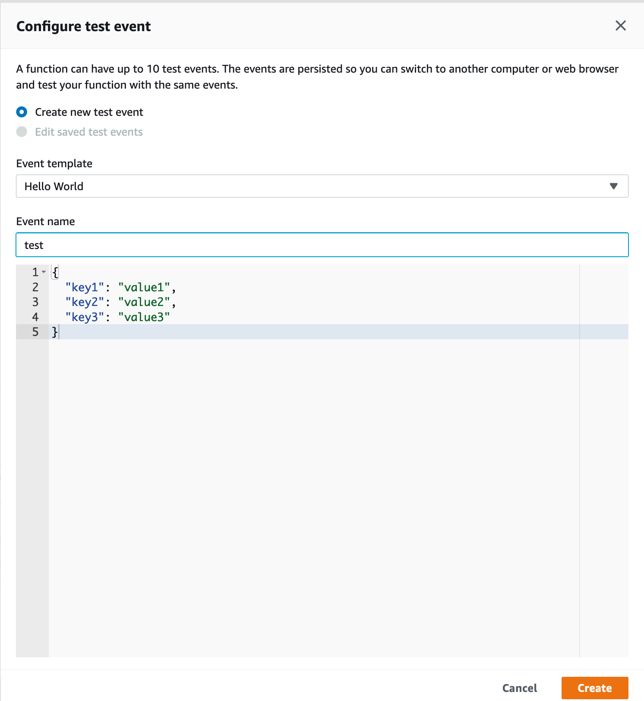

# Solutions for lab 02, Alert Writing

## Spoiler alert!

This document contains solutions to the lab's exercises. Once you read them, there's no going back!  Make sure this is
what you want before reading further :)

Additionally, these are our take on one possible solution to the problem or scenario. You may find perfectly valid, or
even better solutions for each of them. There are multiple good answers!

## Detect the creation of a new tag on an instance.
### Find the data

1. Go in Kibana, and in the "Discover" mode search for the string `CreateTags` over the past hour or so.
2. Find an event that matches your tag creation ( note: there should only be one ): `source:cloudtrail AND details.eventname:CreateTags`

## Craft your simple alert

```python
class AlertCreateTagAlert(AlertTask):
    def _configureKombu(self):
        """Override the normal behavior of this in order to run in lambda."""
        pass

    def alertToMessageQueue(self, alertDict):
        """Override the normal behavior of this in order to run in lambda."""
        pass

    def main(self):
        # How many minutes back in time would you like to search?
        search_query = SearchQuery(minutes=15)

        # What would you like to search for?
        search_query.add_must([
            TermMatch('source', 'cloudtrail'),
            TermMatch('details.eventname', "CreateTags")
        ])

        self.filtersManual(search_query)
        self.searchEventsSimple()
        self.walkEvents()

    def onEvent(self, event):
        category = 'cloudtrail'

        # Useful tag and severity rankings for your alert.
        tags = ['aws', 'cloudtrail']
        severity = 'WARNING'

        # What message should surface in the user interface when this fires?
        summary = 'A user has created a new tag.'

        return self.createAlertDict(summary, category, tags, [event], severity)
```

Make sure to also setup your handler to invoke the alert.

```python
def handle(event, context):
    logger = setup_logging()
    logger.debug('Function initialized.')
    a = AlertCreateTagAlert()
    return 200
```

Then click test and setup an empty event.  



If successful you will see your alert surface in the WebUI.
