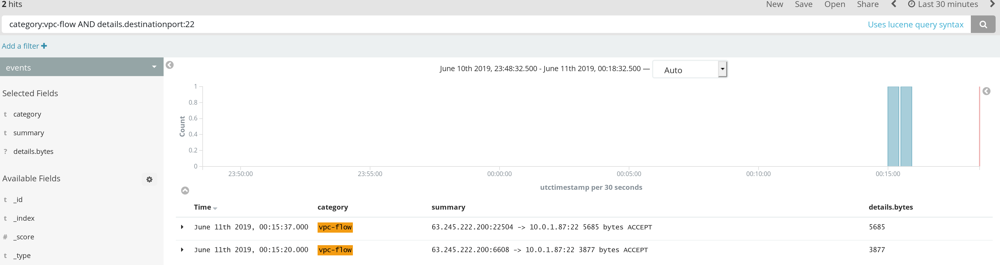

# Solutions for lab 03, Investigating

## Spoiler alert!

This document contains solutions to the lab's exercises. Once you read them, there's no going back!  Make sure this is
what you want before reading further :)

Additionally, these are our take on one possible solution to the problem or scenario. You may find perfectly valid, or
even better solutions for each of them. There are multiple good answers!


## SSH Traffic from the Outside

### Find the data

Find an example event:

1. Go in Kibana, and in the "Discover" mode search for the string `vpc-flow` over the past hour or so.
2. Find an event that hits port 22, or directly search for: `category:vpc-flow AND details.destinationport:22`
3. Look at the event's field `details.bytes` - an unsuccessful connection is usually using less bytes than a successful
   one, so you should see around 3800 bytes for failures, and around 5500 or much more for successes.



### Writing the alert

Copy-paste this code in the Cloud9 editor for Lambda functions and click the "test" button.

```python
from lib.alerttask import AlertTask
from mozdef_util.query_models import SearchQuery, TermMatch

class AlertMyFirstAlert(AlertTask):
    def _configureKombu(self):
        """Override the normal behavior of this in order to run in lambda."""
        pass

    def alertToMessageQueue(self, alertDict):
        """Override the normal behavior of this in order to run in lambda."""
        pass

    def main(self):
        # How many minutes back in time would you like to search?
        search_query = SearchQuery(minutes=15)

        # What would you like to search for?
        search_query.add_must([
            TermMatch('source', 'vpc_flow'), # The source is vpc_flow logs
            TermMatch('details.destinationport', 22)
        ])

        self.filtersManual(search_query)
        self.searchEventsSimple()
        self.walkEvents()

    def onEvent(self, event):
        category = 'vpc_flow'

        # Useful tag and severity rankings for your alert.
        tags = ['aws', 'vpc_flow']
        severity = 'WARNING'

        # What message should surface in the user interface when this fires?
        summary = 'A user attempted an ssh session to port 22.'

        # This could also include correlating the number of bytes exchanged
        # to understand if this was a successful SSH session vs a tcp RESET
        return self.createAlertDict(summary, category, tags, [event], severity)

def handler(event, context):
    a = AlertCloudtrailLoggingDisabled()
    b = AlertMyFirstAlert()
    print(a.main())
    print(b.main())
    return 200
```

## New S3 bucket suddenly made public

### Find the data

Find an example event:

1. Go in Kibana, and in the "Discover" mode search for the string `details.requestparameters.host:s3.us-west-2.amazonaws.com`
2. If that's not sufficient, you can also directly search for `details.eventname:PutBucketPublicAccessBlock` (see
   [https://docs.aws.amazon.com/AmazonS3/latest/API/RESTBucketPUTPublicAccessBlock.html](AWS S3 API documentation))
3. You can also look for `details.eventname:PutBucketAcl` and read `details.requestparameters.accesscontrolpolicy.accesscontrollist.grant`
   Does it contain `"permission": "READ"` for grantee `"uri": "http://acs.amazonaws.com/groups/global/AllUsers"` for
   example? If so, this ACL gives read access to everyone for example. There are a few different interesting, similar S3
   functions.

Note that the event data will contain things such as the IP address, user-agent (S3 Console, etc.), and role, user that
have done the change as well.

### Writing the alert

Copy-paste this code in the Cloud9 editor for Lambda functions and click the "test" button.

```python
from lib.alerttask import AlertTask
from mozdef_util.query_models import SearchQuery, TermMatch

class AlertMyFirstAlert(AlertTask):
    def _configureKombu(self):
        """Override the normal behavior of this in order to run in lambda."""
        pass

    def alertToMessageQueue(self, alertDict):
        """Override the normal behavior of this in order to run in lambda."""
        pass

    def main(self):
        # How many minutes back in time would you like to search?
        search_query = SearchQuery(minutes=15)

        # What would you like to search for?
        search_query.add_must([
            TermMatch('source', 'cloudtrail'),
            TermMatch('details.eventname', 'PutBucketPublicAccessBlock'),
            TermMatch('details.requestparameters.publicaccessblockconfiguration.restrictpublicbuckets', 'false'),
            TermMatch('details.requestparameters.publicaccessblockconfiguration.blockpublicpolicy', 'false'),
            TermMatch('details.requestparameters.publicaccessblockconfiguration.blockpublicacls', 'false')
        ])

        self.filtersManual(search_query)
        self.searchEventsSimple()
        self.walkEvents()

    def onEvent(self, event):
        category = 'AwsApiCall'

        # Useful tag and severity rankings for your alert.
        tags = ['aws', 's3public']
        severity = 'WARNING'

        # What message should surface in the user interface when this fires?
        summary = 'An S3 bucket has been set to public access.'

        # This could also include correlating the number of bytes exchanged
        # to understand if this was a successful SSH session vs a tcp RESET
        return self.createAlertDict(summary, category, tags, [event], severity)

def handler(event, context):
    a = AlertCloudtrailLoggingDisabled()
    b = AlertMyFirstAlert()
    print(a.main())
    print(b.main())
    return 200

```
